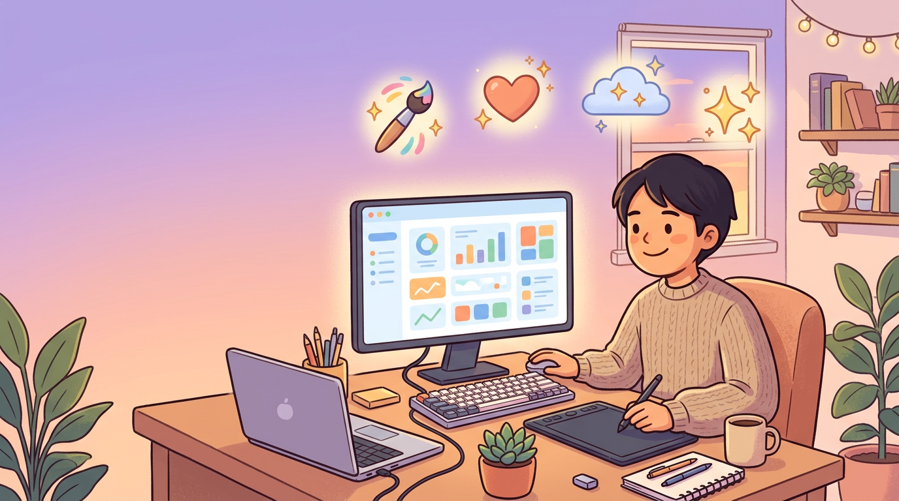
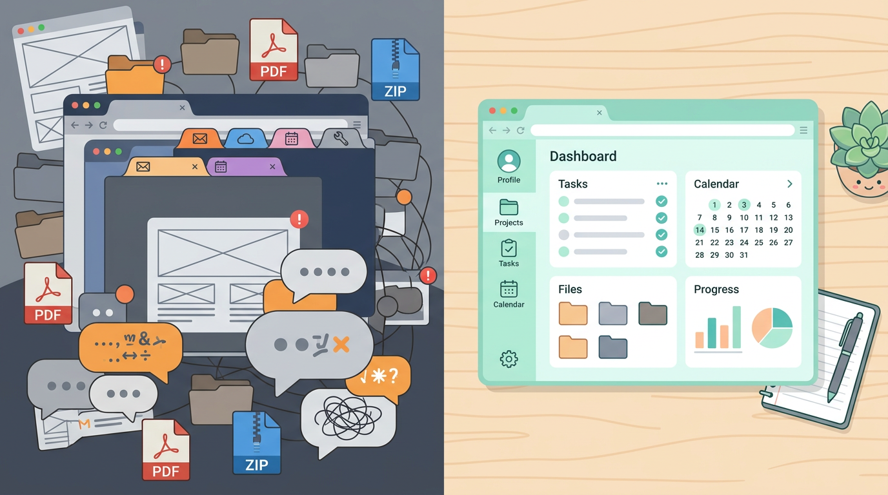
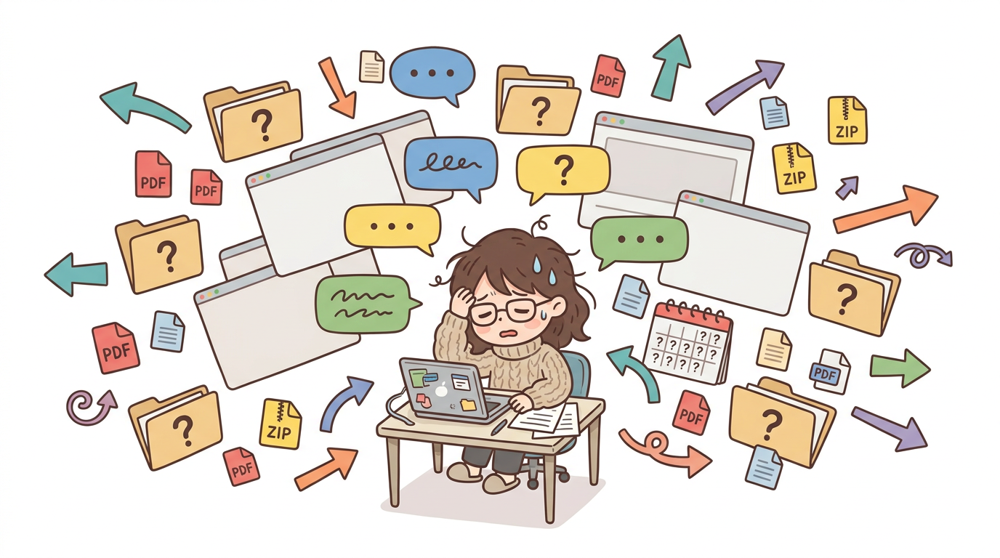
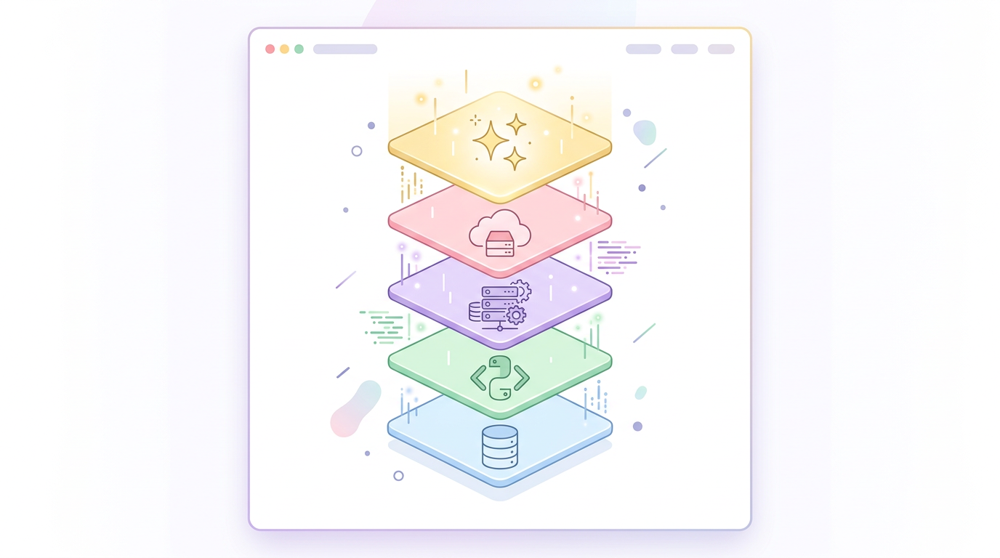
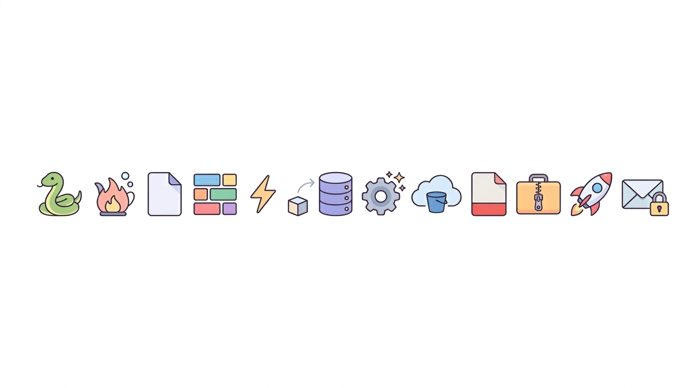
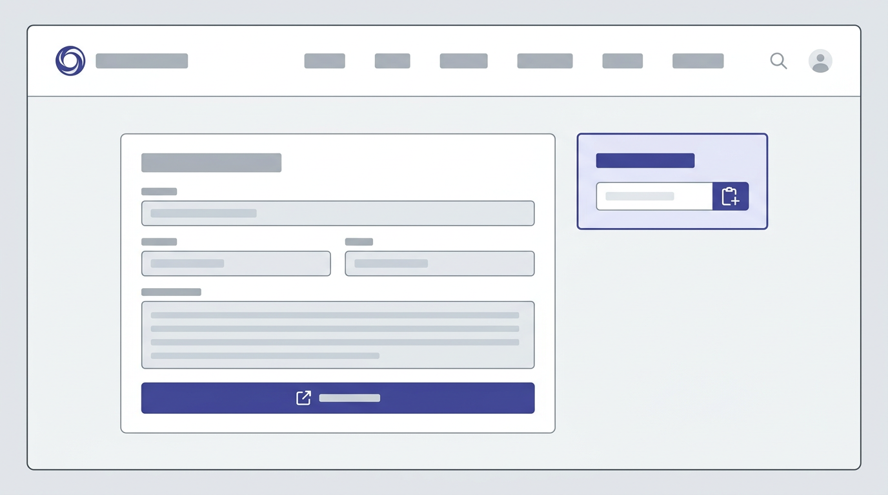
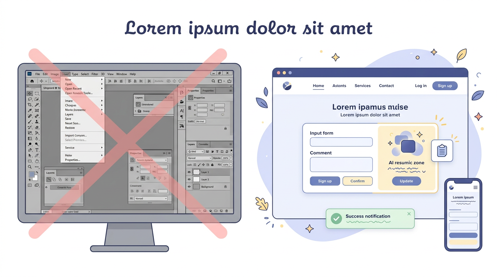

# いち個人クリエイターが、自分用ポータル（Creator Portal）を作り始めた話【下書き】

**作業日:** 2026-04-04  
**メモ:** note に載せる前にもう一声推敲する用

**挿絵（`images/` フォルダ）**  
この下書きと同じ階層の `images/` に PNG を置いています。Cursor や VS Code のプレビューでは相対パスで表示されます。  
**note に投稿するとき：** エディタの「画像を追加」から各 PNG をアップロードし、下のキャプションをそのまま説明文に使うと読みやすいです。

**アイキャッチ画像：** `images/2026-04-04_eyecatch.png`  
note の投稿画面で **「アイキャッチを設定」**（一覧・シェア時のサムネ用）にこのファイルを指定してください。本文の先頭に同じ画像を入れなくても大丈夫です（二重表示を避けるため）。

---

## まず結論から

Stable Diffusion で描いて、Pixiv や販売サイトに出してる身として、「制作そのもの」より **前後の事務・整理・文章づくり** の方が地味に時間を食ってるな、と最近ずっと感じていました。  
なので **ブラウザひとつでだいたい完結する自分専用アプリ** を、Python でこしらえ始めています。名前は仮で **Creator Portal**。この記事は、なんで作ったか・何で組んだか・画面はどう考えたかのメモです。

  
*（キャプション例）制作の前後でフォルダ・チャット・別アプリに散らばりがちな作業を、いつかはポータルに寄せたい、というイメージ図。*

---

## なんでプロジェクトにしたのか

やりたいことはシンプルで、**「毎回同じようなことを別々の場所で繰り返す」のをやめたい** という話です。

  
*（キャプション例）ストーリー→プロンプト→画像→投稿文→PDF/ZIP まで、ツールと場所が分かれていて「あれどこだっけ」が増えるイメージ。*

ストーリーや章の構成を考えて、それを SD 用プロンプトに落とす──ここまで、今まではチャットにコピペしたり、タブを行ったり来たりしてました。  
生成した画像はローカルのフォルダに溜まっていくんですが、「これいつの？ どのキャラのセット？」みたいなのがフォルダ名頼りになって、正直しんどい。

あと Pixiv のタイトルとキャプション、販売ページ用の文章も、また別のタイミングで AI にお願いして……という **同じ系統の作業がバラバラ** に起きる。  
PDF にまとめたり ZIP にしたりも、別ツール。  

そして一番まずいのが **「いつ何を作って、いつ出すか」がいきあたりばったり** なこと。悪いわけじゃないんですが、記録が散らばると後から自分が追えなくなる。

理想は、月に 2〜3 時間くらい溶けてた「制作まわりの雑務」を、**もっと短く**（イメージとして 30 分圏内に近づくと嬉しい）すること。  
キャラの CKPT や LoRA はもうローカルで決まってるので、ポータル側では **「誰で」「どんな構成・シチュで」「投稿用の文まで」** を一か所に寄せていく、という発想です。

---

## 技術はこんな感じ（雑に理由つき）

  
*（キャプション例）「個人で回せる塊」として、DB・アプリ・生成 AI・クラウド保存がどう重なるかのイメージ。*

  
*（キャプション例）「雑に理由つき」の各パーツが、どんな道具の寄せ集めか一目で眺めるための図。細部は本文どおり。*

個人で回す前提なので、**自分が後から読んでも直せるか** と **サーバー代を抑えられるか** を優先しました。

バックエンドは **Python + Flask**。TypeScript でガチガチに組むより、自分の脳みそに合わせた方が長く付き合える気がする。  
画面は **Jinja2** で HTML を出して、見た目は **Tailwind（CDN）** でサッと。フロントの JS は増やしたくないので、ページの一部だけパッと差し替えたいところに **htmx** を使う、という割り切り。

DB は開発中 **SQLite**、本番はそのうち **PostgreSQL** に逃がせれば十分。**SQLAlchemy** と **Flask-Migrate** でマイグレーションまで含めて管理。

生成 AI は今回 **Gemini** に寄せています（SDK は `google-genai`）。返ってきた JSON をパースして画面に載せる、というシンプルな使い方。  
画像は **S3** に上げて、boto3 で触る。PDF は **fpdf2** と Pillow、ZIP は **標準の zipfile** だけでいいや、と。

デプロイ先は **Render とか Railway** の無料〜安めの枠を想定。秘密情報は **`.env`** に閉じて、Git には載せない。当たり前ですが念のため。

---

## UI / UX は「毎日触る道具」基準

  
*（キャプション例）SPA にせず、共通ナビとフォーム中心。生成結果だけパッと差し替え、テキストはコピーしやすく、という考え方の図。*

  
*（キャプション例）巨大 SPA より、フォームとサーバー HTML、部分更新・コピー・フラッシュ、レスポンシブ──「道具」として負担が少ない方向の図。*

**React で巨大 SPA** はやらない、と最初に決めました。個人開発が重くなるし、クリエイター業務の UI としてはオーバーキルになりがちだからです。

基本は **フォームを送る → サーバーが HTML を返す** の王道。AI 生成だけ、**そのブロックだけ htmx で更新**して、「待ってる感」を画面全体に広げないようにしています。  
プロンプトや生成テキストは **コピーボタン** を置きがち。Pixiv に貼るとき、一手でいけるのが地味に大事。

保存した・消した・エラー、は **フラッシュメッセージ** で一言。S3 や API キーが足りないときも、**何が足りないか画面で分かる** ようにして、黙って失敗しないようにしたいなと。

上のナビは全部共通で、ダッシュボード・ストーリー・テキスト生成・画像・PDF/ZIP・キャラ・作品・プロンプト・売上、と並べてあります。  
スマホで見ても破綻しにくいよう、Tailwind で余白と折り返しだけはちゃんと。

DB もキャラ・作品・ストーリー・プロンプト・画像・月次売上みたいに分けて、ダッシュボードで **ざっくり数と最近のもの** が見えるようにしておくと、後から PDF 用に画像を選ぶときも「これ誰のやつだっけ」が減るはず、という期待です。

---

## おわりに

まだ作り途中なので、「本当に時間が縮んだか」は数週間運用してから書き足したいです。  
note に出すなら、**スクショ 1〜2 枚**（個人情報は消して）があると読者にも伝わりやすいかも。自分用メモとしても、あとで見返したときに助かる。

---

*リポジトリ内の下書きメモです。公開するときは、数字やエピソードを実体験ベースに差し替えて OK。*
