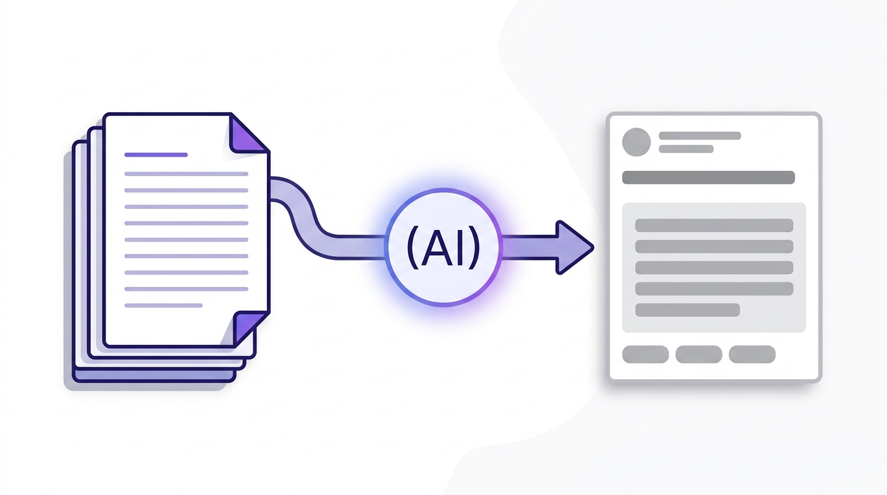
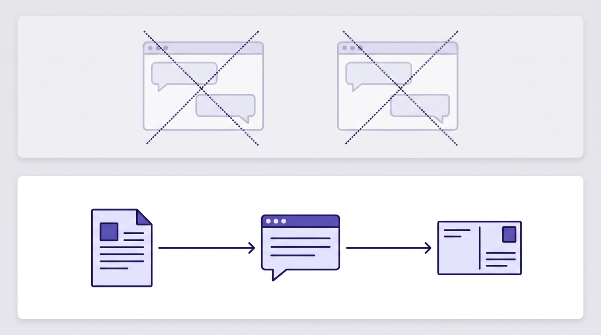

# 生成したストーリーをそのまま「資料」にして、Gemini 相談で Pixiv 文面まで出す【下書き】


*（アイキャッチ用）note 投稿時は **アイキャッチ設定** にも同じ `images/2026-04-05_eyecatch.png` を指定すると、一覧・シェア時に表示されます。*

**作業日:** 2026-04-03  
**メモ:** ポータル全体の動機・技術は [2026-04-04.md](2026-04-04.md)。**本稿はその中の機能単位**（ストーリー × 相談連携）の記録。公開前に日付や表現を実態に合わせて調整して OK。

**挿絵・画像の置き場所**  
`drafts/images/` の PNG を、下記 `` と同じファイル名で置いています。VS Code / Cursor のプレビューでは相対パスで表示されます。  
**note に投稿するとき：** エディタの「画像を追加」から各 PNG をアップロードし、下の *イタリック* のキャプションを画像の説明文にコピーすると読みやすいです。

---

## まず結論から

**自分用 Creator Portal** でストーリーを生成・保存したあと、**同じ内容をコピペし直さずに**、下部の **Gemini 相談ドック** に「ストーリー資料」として渡して、**Pixiv のタイトル・キャプション・タグ案**まで一気にお願いできるようにしました。

やりたかったのは、「ストーリー用チャット」と「販売文用チャット」で**同じ話を二度説明する**のを減らすことです。



*（挿絵・キャプション例）保存済みストーリーを「資料」としてシステム側に添え、販売文モードの相談で Pixiv 向け文案まで一気に依頼する流れの図解。*

---

## なんでこの機能を足したのか

ポータルではもともと、ナビから **テキスト生成** や **相談（アドバイザー）** で Gemini を触れるようにしていました。  
一方で、**ストーリー詳細ページ**で読んでいる本文と、Pixiv 用の短い言い回しは、コンテキストとしては同じ根っこから来るはずなのに、相談側に**手で貼り直す**とズレたり、長すぎて切ったり、が起きがちです。

なので、

- **保存済みストーリー**なら DB から章まで含めてテキスト化した「資料」を組み立てる  
- **一覧で今しがた生成しただけ**のものなら、JSON をセッションに載せて同じ形式で資料にする  

という二通りを用意し、**相談のシステム側に資料を末尾で添える**形にしました。ユーザー履歴は長くしすぎず、**モード説明＋資料**で答えてもらうイメージです。



*（挿絵・キャプション例）上：別々のチャットに同じ話を貼り直しがちな状態／下：資料付きの相談ドックひとつで続きが書ける状態、という対比イメージ。*

---

## 画面・操作はこんな感じ

- **ストーリー詳細**の相談ドックに、**「ストーリー資料を相談に含める」** チェック（既定オン）。オフにすれば従来どおり資料なし。  
- 資料があるときは相談モードの初期値を **販売文・キャプション（Pixiv 等）** 寄りにして、**タイトル・キャプション・タグを具体案で** と依頼しやすくした。  
- **一覧の生成直後**は「この生成結果を相談ドックに渡す」でセッションにスナップショットを載せ、下部相談から続けられる。  
- **会話リセット**やモード変更時に、ドラフト用セッションもきちんと消す（古い生成が残り続けないように）。

ユーザー向けの説明は `docs/USER_MANUAL.md` にも短く追記してあります。

---

## 実装メモ（雑に）

- ルート: `advisor_chat` まわりで、ストーリー JSON → プレーンテキスト化（長さは上限付きでトリム）、テンプレート用コンテキスト注入。  
- `POST /advisor/attach-draft` で生成結果をセッションへ。  
- `attach_story` かつ資料ありのとき、**システムプロンプト末尾に資料を追記**（履歴は短く保つ）。  
- フォーム改ざん対策として、POST の `story_context` が異常に大きい場合は **400** で弾く（後から足したガード）。

細部のファイル名は公開記事では書かなくてもよいので、必要ならリポジトリを見て補足してください。

---

## note 投稿用タグ（コピペ用）

**次の1行をまるごとコピー**して、note のタグ入力欄や本文末尾のハッシュタグに貼り付けてください。使わないタグは消して OK です。

```
#個人開発 #Python #Flask #生成AI #Gemini #Pixiv #創作 #クリエイター #開発日記
```

**同人・イラスト寄せに足す場合（任意・1行コピペ）**

```
#個人開発 #Python #Flask #生成AI #Gemini #Pixiv #創作 #同人 #イラスト #クリエイター #開発日記
```

---

## おわりに

「ストーリー」と「投稿用の文章」が**同じアプリ内でつながった**のは、個人的には地味に効くはずです。  
まだ運用しながら、「資料の長さ」「タグの粒度」「R-18 表現の注意書き」などはプロンプト側で詰めていく予定です。

---

*リポジトリ内の下書きメモです。note に出すときはトーンを整え、必要なら実画面のスクショを足すとさらに伝わりやすいです。*
