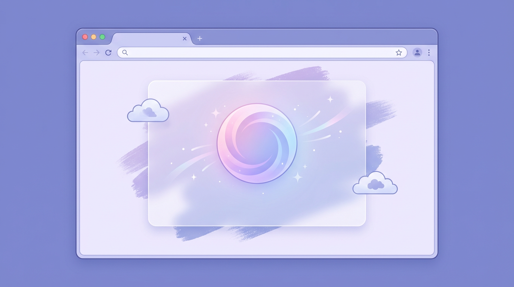

# Creator Portal 開発日誌：ログ・進捗表示・削除高速化・遅延ロードまで一気に【下書き】

**作業日:** 2026-04-18  
**対象:** 自分用 Flask アプリ **sd-creator-hub2**（GitHub: `izumi777777/sd-creator-hub2`）  
**メモ:** 公開前に表現や日付を手直しして OK。API キー・バケット名・本番 URL は書いていません。

*（アイキャッチ）note 投稿時は `images/2026-04-18_01_conclusion.png` などを **画像を追加** で貼り、任意で **アイキャッチ設定** にすると一覧で目立ちます。*

---

## まず結論

*ログ・進捗UI・TZ・一括削除・遅延ロードを同日にまとめた整理図*

同じ日に、次のような **「運用で効く」改善** をまとめて入れました。

| テーマ | 一言 |
|--------|------|
| **ログ** | 画像生成・Gemini・S3・DB・HTTP リクエストの流れと所要時間がコンソールで追える |
| **生成中 UI** | 「今すぐ生成」中にサーバー側のステージをポーリングし、オーバーレイに進捗表示 |
| **予約（Windows）** | `tzdata` 未導入でも `ZoneInfo` が落ちないようフォールバック＋依存追加 |
| **一括削除** | S3 は `delete_objects` でバッチ化、DB は1回の `DELETE`＋コミット |
| **一覧の体感速度** | `IntersectionObserver` で `data-lazy-src` から遅延ロードし、`load` が画像待ちしない |

「クリエイターが触る部分が軽く・壊れにくく・原因が追いやすい」方向の一日、という整理です。

---

## 1. ログ出力の強化

*HTTP・S3・Gemini・生成パイプラインをgrepしやすい粒度で*

**狙い:** 画像生成や S3、Gemini、ページ表示のどこで時間がかかっているかを、ターミナルだけで追えるようにする。

- **Flask 起動時:** ログレベル・外部ライブラリ（boto3 等）の抑制、起動バナー。
- **HTTP:** リクエストごとに所要時間。遅いルートは **3 秒超で WARNING** になるようにして、ボトルネックの目印に。
- **S3:** アップロード・単体削除・**署名 URL 一括**の開始／完了／失敗と ms。
- **Gemini:** JSON／テキスト／チャットそれぞれで試行ごとの ms と合計 ms。
- **画像生成パイプライン:** Web UI 呼び出し、焼き込み、メタ除去、S3、スケジューラジョブなどにログを細かく。
- **開発時既定:** `LOG_LEVEL` のデフォルトを `DEBUG` に（本番は `.env` で `INFO` 推奨）。

「全部 INFO で埋まる」より、**レベルとプレフィックスでgrepしやすい**形を意識しました。

---

## 2. 画像生成中の進捗（コンソール＋ブラウザ）

*ポーリングでステージ名＋経過秒を表示するUIの雰囲気*

**問題:** 「今すぐ生成→S3」のあいだ、ブラウザは固定メッセージのまま。サーバー側もどの工程か分かりにくい。

**対応:**

- **サーバー:** `story_sd_generation` にスレッドセーフな **進捗ストア** を持たせ、`_set_progress(story_id, stage, detail)` で段階更新。ログにも `[進捗]` 行を出す。
- **API:** `GET /story/<id>/generate-progress` で JSON ポーリング用に公開。
- **フロント:** ストーリー詳細のオーバーレイを **1 秒間隔でポーリング**し、ステージ名に応じた日本語ラベル＋経過秒を表示。フォームに `data-story-sid` を付与。

タブ切替で非表示だったパネル内の画像も、表示後に **再度 `registerLazyImages`（後述）と同様の再登録**が走るよう、ギャラリー用スクリプト側も調整しています（※遅延ロード導入後の話は次節とセットで効きます）。

---

## 3. Windows で予約登録が 500 になる件

*`tzdata` と JST フォールバックの二本立て*

**原因:** Python 3.9+ の `zoneinfo` は、Windows では **IANA データ用の `tzdata` パッケージ**が無いと `Asia/Tokyo` も `UTC` も解決できず、`ZoneInfoNotFoundError` で落ちる。

**対応:**

- **`requirements.txt` に `tzdata` を追加**（通常の `pip install -r` で解消）。
- **`schedule_timezone.scheduler_zoneinfo`:** `ZoneInfo` が使えない環境では **UTC は `datetime.timezone.utc`**、`Asia/Tokyo` は **固定 JST（UTC+9）** にフォールバックし、予約の壁時計解釈だけは破綻しないようにした。

「本番は Linux で動くが、開発は Windows」という構成でも予約が通るのが目的です。

---

## 4. 画像の一括削除を高速化

*`delete_objects` と単一コミットで枚数に強く*

**原因:** 一括削除で `delete_portal_image` を **1 枚ずつ**呼んでおり、S3 API と DB コミットが枚数分直列。

**対応:**

- **`s3_service.delete_objects_batch`:** `delete_objects` で最大 1000 件／リクエスト。キーは重複除去。
- **`image.bulk_delete` / `story.bulk_delete_story_images`:** 対象行を `IN` で一括取得 → S3 バッチ削除 → 失敗キー以外を **一括 `DELETE` + 1 コミット**。
- **単体削除のリダイレクト:** `character_id` / `story_id` / `storage_folder` を引き継ぎ、**削除前と同じ絞り込みの一覧**に戻る。

枚数が多いほど、体感差が出るタイプの改善です。

---

## 5. 画像の遅延ロード（初期表示の「スピナーが長い」問題）

*`data-lazy-src` と rootMargin で初期表示を軽く*

**原因:** `window.load` は **ページ内の全 `` の取得完了まで**待つ。署名付き URL 直貼りだと枚数×サイズ分、ロードバーが長くなる。

**対応:**

- **`data-lazy-src` に URL、`src` は空**で HTML を返し、**`IntersectionObserver`**（rootMargin 200px）でビューポート付近になったら `src` をセット。
- **`base.html` に共通スクリプト**＋ **`window.registerLazyImages(root)`** を公開。`htmx:afterSwap` でも再登録。
- **ストーリー分割ギャラリー・画像一覧のマクロ**の `` を差し替え。**`width` / `height`** でプレースホルダ領域を確保（CLS 軽減）。

「HTML と操作 UI はすぐ使える → 画像はスクロールに合わせて後から」という体感になります。

---

## 実装メモ（ファイル単位・雑）

*ログ・進捗・TZ・削除・遅延ロードの参照先を一枚に*

| 領域 | 主なファイル |
|------|----------------|
| ログ | `app/__init__.py`, `config.py`, 各 `routes/*`, `services/*` |
| 進捗 | `story_sd_generation.py`, `routes/story.py`, `templates/story/detail.html` |
| TZ | `services/schedule_timezone.py`, `requirements.txt` |
| 削除 | `services/s3_service.py`, `routes/image.py`, `routes/story.py` |
| 遅延ロード | `templates/base.html`, `image/index.html`, `story/_images_split_gallery*.html` |

コミットは用途ごとに分割して `main` にプッシュ済み（履歴を見ると分かりやすいです）。

---

## 振り返り

*データが増えた瞬間に効く改善と、突然壊れる系の予防*

- **ログと進捗**は「自分しか見ないツール」ほど後から効く投資だと思っています。  
- **削除と遅延ロード**は、データが増えた瞬間に効いてくるタイプ。  
- **Windows の TZ** は「ある日突然バグる」系なので、フォールバック＋依存明示の二本立てにしたのがよかったところです。

同じような自分用ポータルを育てている方の参考になればうれしいです。

---

## note に貼るときのメモ

- 見出しレベルは note エディタに合わせて調整して OK。  
- 個人情報・鍵・本番 URL は載せない。  
- 挿絵を足すなら `drafts/images/` に置き、note 側は **「画像を追加」** でアップロードする運用（`note/note.md` の運用メモ参照）。
